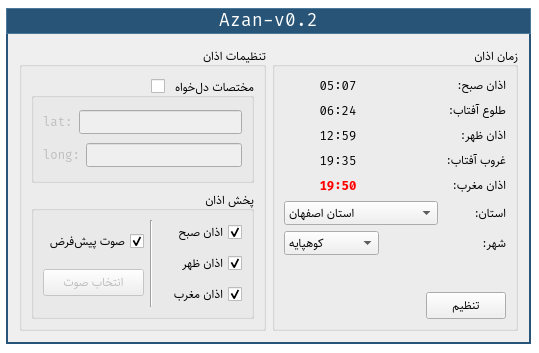

# IN THE NAME OF GOD

Azan time calculation, besed on [this algorithm](http://praytimes.org/calculation) and [this](http://praytimes.org/manual#Downloads_and_Examples) library.

## Screenshot

## Dependency 
   - libc
   - Qt5
  
## Build System
   - QMake 3.1
	
## Tested Platforms
   - ArchLinux [linux-5.6.5-arch3-1]
   - Ubuntu 19.10
	
## Tested Compilers
   - GCC 9.3.0

## TODO
   - [ ] Compile on windows.
