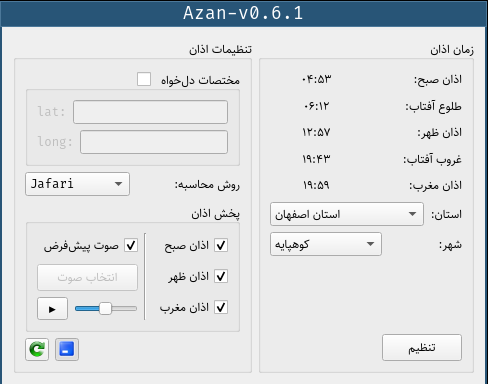
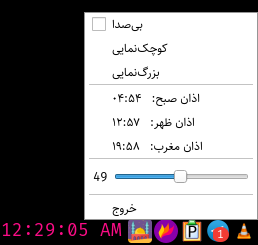

# IN THE NAME OF GOD

Azan time calculation, besed on [this algorithm](http://praytimes.org/calculation) and [this](http://praytimes.org/manual#Downloads_and_Examples) library.

## Screenshot
 

## Dependency 
   - glibc (libprayer_time_calc dosn't work with musl)
   - Qt5.14.1 (Widgets, Multimedia)
  
## Build System
   - QMake 3.1
	
## Tested Platforms
   - ArchLinux [linux-5.6.5-arch3-1]
   - Ubuntu 19.10
   - Windows 10 build 18363
	
## Tested Compilers
   - GCC 9.3.0
   - MSVC2015

